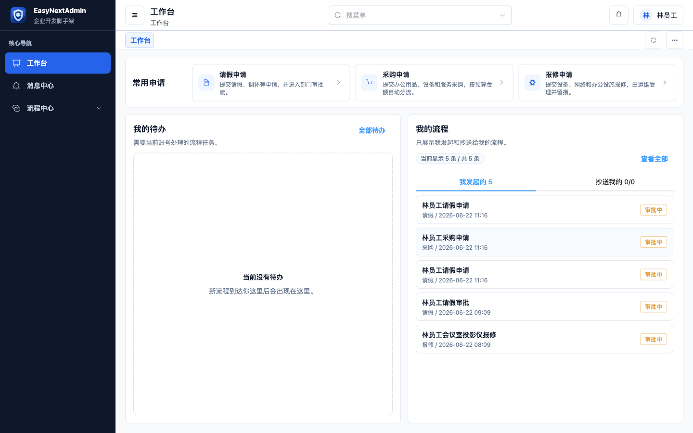
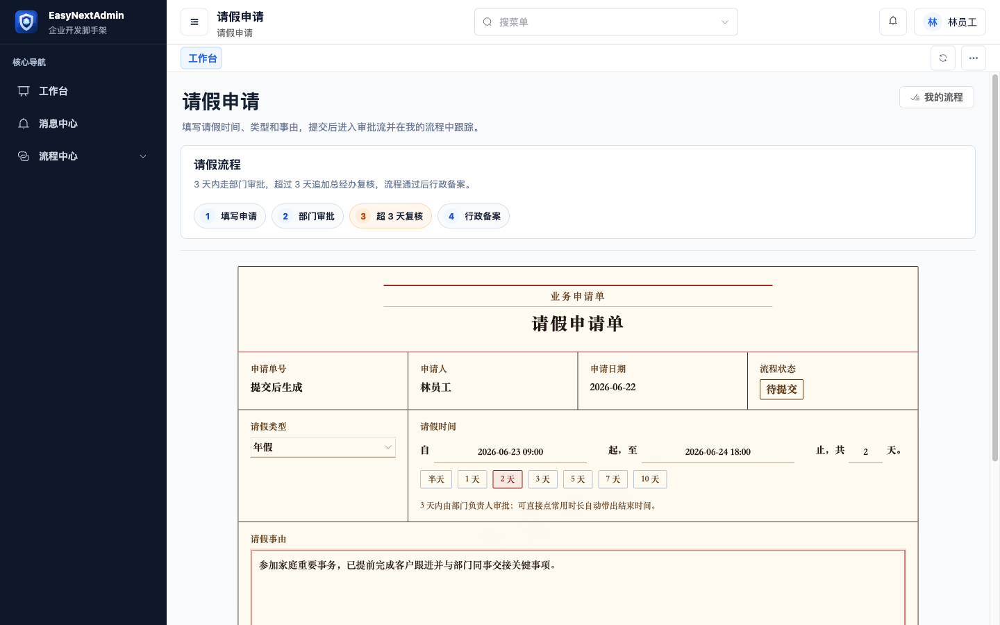
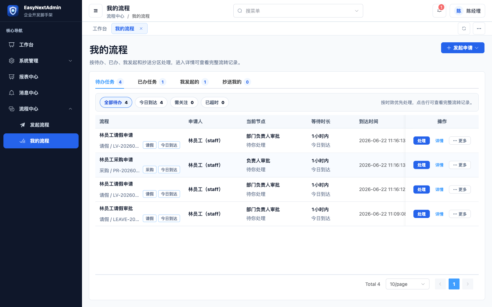
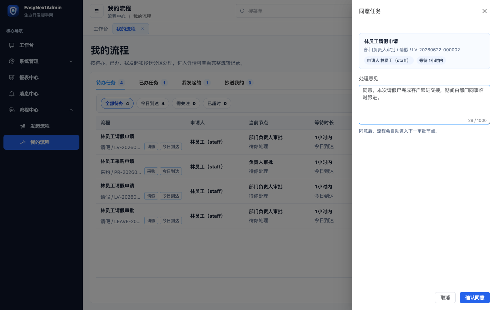
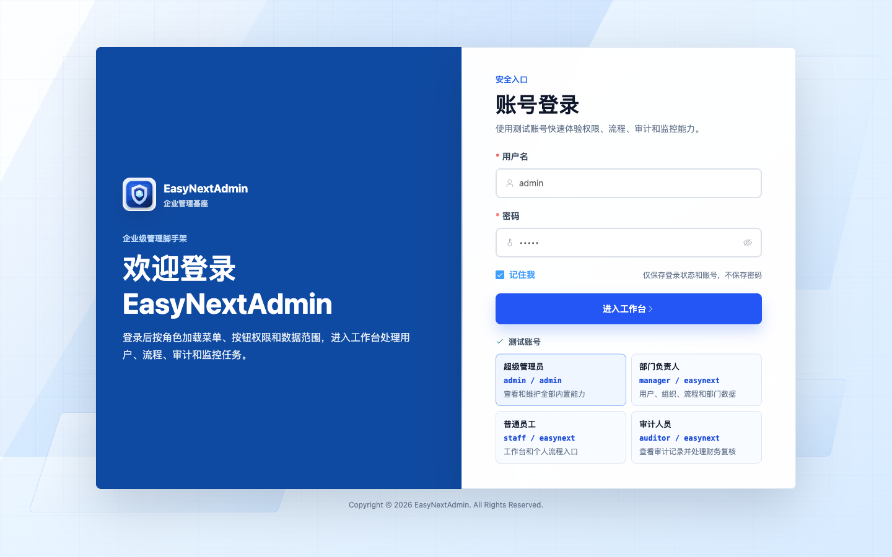
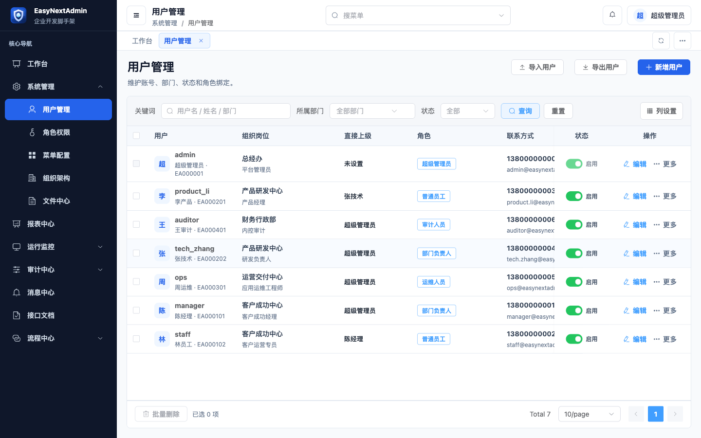

# EasyNextAdmin

[](https://github.com/lakernote/easy-next-admin/actions/workflows/ci.yml)
[](LICENSE)
[](https://adoptium.net/)
[](https://vuejs.org/)

EasyNextAdmin 是一套面向中文企业后台二次开发的 Spring Boot 3 + Vue 3 开源脚手架。它不是只展示页面的空壳模板，而是把企业后台常见的用户组织、角色权限、菜单路由、数据范围、审计、监控、文件、消息、定时任务和轻量流程串成一套可运行的工程基线。

如果你要做 OA、运营后台、审批流、权限审计、运维管理、内部工具或企业信息化系统，EasyNextAdmin 的目标是让团队拉下代码后少搭基础设施，直接进入业务开发。

## 为什么选择 EasyNextAdmin

- **真实后台闭环**：登录、菜单、按钮权限、角色授权、数据范围、用户导入导出、审计、监控、WebLog、文件和流程都能本地跑通。
- **前后端契约清晰**：菜单和权限资源以服务端 `sys_menu` 为事实源，前端动态路由和按钮权限都来自后端授权结果。
- **技术栈新且克制**：Spring Boot 3、Java 17、Vue 3、TypeScript、Vite、Element Plus，不引入低代码、BI 或完整 BPM 平台的复杂度。
- **适合二开学习**：代码按企业后台真实模块拆分，核心位置保留简洁中文注释，便于团队理解和扩展。

## 项目状态

当前版本：`0.1.0-alpha.0`。这是首个公开 alpha 版本，核心功能已具备本地启动、测试和构建验证；生产上线前仍应替换数据库、Redis、域名、HTTPS、默认账号密码和会话安全方案。

| 适合 | 不适合 |
| --- | --- |
| 中文企业后台二次开发、权限/组织/审计/流程类内网系统、需要前后端分离脚手架的团队 | 低代码平台、BI 平台、完整 BPM 引擎、只展示 UI 模板的项目 |

## 界面预览

业务工作台：



核心业务流：

| 提交申请单 | 审批待办列表 | 审批处理 |
| --- | --- | --- |
|  |  |  |

<details>
<summary>查看更多界面截图</summary>





</details>

## 技术栈

| 层 | 技术 |
| --- | --- |
| 后端 | Java 17、Spring Boot 3.5、MyBatis-Plus、Flyway、Spring Actuator、springdoc-openapi、Redisson、Caffeine |
| 前端 | Vue 3、TypeScript、Vite、Pinia、Vue Router、Axios、Element Plus、ECharts、LogicFlow |
| 本地依赖 | MySQL 8.4 LTS、Redis 7.4 |
| 部署 | 后端可打 JAR 或 Docker 镜像，前端输出静态资源并由 Nginx 托管 |

## 快速启动

环境要求：

- JDK 17+
- Maven 3.9+
- Node.js 22 LTS 或 24 LTS，以及随 Node.js 安装的 npm
- Docker 和 Docker Compose

启动本地依赖：

```bash
docker compose up -d
```

启动后端：

```bash
cd easy-next-admin-server
mvn spring-boot:run
```

启动前端：

```bash
cd easy-next-admin-web
npm ci
npm run dev
```

首次启动时，后端会通过 Flyway 自动创建表结构和初始化演示数据。

访问地址：

- 前端：http://127.0.0.1:5174
- 后端：http://127.0.0.1:8080
- OpenAPI：http://127.0.0.1:8080/swagger-ui.html

默认演示账号。登录页只在 `local` profile 通过 `/api/auth/demo-accounts` 返回这些账号；生产 profile 不返回演示密码，正式环境必须替换初始化密码：

| 角色 | 账号 | 密码 | 用途 |
| --- | --- | --- | --- |
| 超级管理员 | `admin` | `admin` | 查看和维护全部内置能力 |
| 部门负责人 | `manager` | `easynext` | 组织、流程和部门数据 |
| 普通员工 | `staff` | `easynext` | 工作台和个人流程入口 |
| 审计人员 | `auditor` | `easynext` | 审计记录和财务复核类待办 |

更完整的本地开发说明见 [本地开发](docs/getting-started.md)。

## 内置能力

| 能力 | 页面入口 | 说明 |
| --- | --- | --- |
| 工作台 | `/dashboard` | 聚合个人待办、常用申请、系统能力和关键统计 |
| 系统管理 | `/system/users`、`/system/roles`、`/system/menus`、`/system/departments`、`/system/files` | 用户、直属上级、用户导入导出、角色、菜单权限、部门负责人、组织架构和文件中心 |
| 报表中心 | `/reports/enterprise` | 组织人员台账和采购流程复核的 A4 纸质报表预览与打印 |
| 运行监控 | `/monitor/server`、`/monitor/online`、`/monitor/cache`、`/monitor/cache-list`、`/monitor/weblog` | 应用运行状态、在线用户、缓存指标、缓存键值和在线请求日志 |
| 审计中心 | `/audit/behavior` | 登录、操作、数据变更、错误和接口访问审计 |
| 任务调度 | `/schedule/jobs` | 动态任务定义、启停和执行日志 |
| 流程中心 | `/workflow/start`、`/workflow/tasks`、`/workflow/instances`、`/workflow/console` | 统一发起请假、采购、报修流程，处理我的流程，按直属上级、部门负责人、职能角色等规则派单，管理员监控流程实例和维护流程配置 |
| 消息中心 | `/messages` | 个人消息、流程通知、审计提醒和任务消息 |
| 个人中心 | `/profile/security` | 个人资料、改密、登录历史和会话管理 |

功能说明、组件用法和实现原理见 [功能与组件](docs/features-and-components.md)。

## 工程结构

```text
easy-next-admin
├── easy-next-admin-server   # Spring Boot 3 服务端
│   └── Dockerfile           # 服务端镜像构建
├── easy-next-admin-web      # Vue 3 + Vite + Element Plus 前端
│   ├── Dockerfile           # 前端镜像构建
│   └── nginx.conf           # 前端容器 Nginx 配置
├── docs                # 开源项目文档
├── docker-compose.yml  # 本地 MySQL、Redis 依赖
└── pom.xml             # Maven 聚合工程
```

菜单、页面路由、角色授权资源和页面权限码以服务端 `sys_menu` 为唯一事实源。前端只通过 `/api/auth/me` 接收当前账号可见菜单，并在 `easy-next-admin-web/src/router/dynamicRoutes.ts` 中把 `component_path` 解析到本地 Vue 页面；按钮权限使用 `v-permission`，后端接口继续由 `@EasyPermission` 兜底。

## 编译打包

后端：

```bash
mvn -pl easy-next-admin-server -am -DskipTests package
```

产物：

```text
easy-next-admin-server/target/easyNextAdmin.jar
```

前端：

```bash
cd easy-next-admin-web
npm ci
npm run build
```

产物：

```text
easy-next-admin-web/dist
```

部署方式、Nginx 反向代理、Docker 构建和生产配置覆盖见 [编译与部署](docs/deployment.md)。

## 发布前验证

发布或提交 PR 前建议至少运行：

```bash
mvn -pl easy-next-admin-server -am verify
cd easy-next-admin-web
npm ci
npm run test:unit
npm run build
```

本仓库已配置 GitHub Actions，在 `main` 分支 push 和 pull request 时会执行后端 `verify`、前端单元测试和前端构建。

## 文档

- [文档目录](docs/README.md)
- [本地开发](docs/getting-started.md)
- [编译与部署](docs/deployment.md)
- [功能与组件](docs/features-and-components.md)
- [架构与实现原理](docs/architecture.md)
- [参考项目与借鉴边界](docs/reference-projects.md)

## 开源协作

- [贡献指南](CONTRIBUTING.md)
- [安全策略](SECURITY.md)
- [更新日志](CHANGELOG.md)

默认启动不需要额外 `.env` 文件。Docker Compose 依赖端口和前端开发代理都带默认值，确需覆盖时可用命令行环境变量或本机不提交的 `.env` / `easy-next-admin-web/.env.local`。`.editorconfig` 用于统一 IDE/编辑器格式；默认账号和默认密码只用于本地开发，生产环境必须覆盖。

## 参考项目

EasyNextAdmin 主要参考 RuoYi/RuoYi-Vue 的中文企业后台习惯，参考 Vben Admin 的前端权限与路由组织思路，参考 Flowable/Camunda 在流程领域的产品边界，同时直接使用 Element Plus、ECharts、LogicFlow 等开源组件。详细说明见 [参考项目与借鉴边界](docs/reference-projects.md)。

## 许可证

本项目使用 [Apache License 2.0](LICENSE)。
