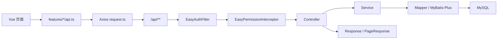
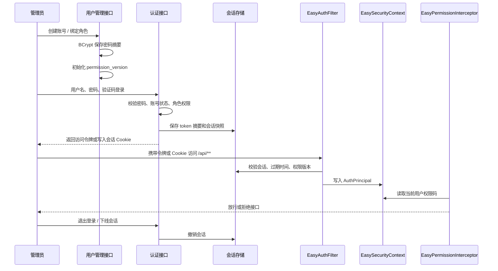

# 架构与实现原理

EasyNextAdmin 是单体优先的企业后台脚手架。后端按模块分层，菜单、路由和权限资源以数据库 `sys_menu` 为唯一事实源，前端根据登录账号返回的授权菜单动态装配页面。

## 总体结构

```text
easy-next-admin
├── easy-next-admin-server
│   ├── common          # 统一响应、异常、常量、工具
│   ├── config          # Spring、MyBatis、WebMVC、OpenAPI、线程池等配置
│   ├── infrastructure  # 认证、权限、数据范围、审计、缓存、锁、幂等、限流、观测性
│   └── module          # 系统、报表、监控、审计、调度、流程、消息等业务模块
└── easy-next-admin-web
    ├── src/features     # 业务 API、类型和前端领域逻辑
    ├── src/views        # 页面
    ├── src/components   # 通用组件
    ├── src/router       # 路由守卫和动态路由解析
    ├── src/permissions  # 按钮权限码常量
    └── src/stores       # Pinia 状态
```

## 请求链路



关键点：

- 前端页面只依赖 feature API，不直接散落 Axios 调用。
- `EasyAuthFilter` 从 token 解析当前会话和用户权限。
- `EasyPermissionInterceptor` 校验控制器或方法上的 `@EasyPermission`。
- MyBatis 数据权限拦截器在查询阶段追加组织范围过滤。
- 返回值通过统一响应对象和异常处理器保持前后端契约稳定。

## 认证与会话

认证组件入口：

```text
POST /api/auth/login
GET  /api/auth/me
POST /api/auth/logout
GET  /api/auth/demo-accounts
```

核心实现：

```text
EasyAuthService                 # 登录、会话创建、会话恢复、退出
EasyAuthFilter                  # /api/** 请求认证过滤器
EasyPermissionInterceptor       # @EasyPermission 接口鉴权
EasySecurityContext             # 单次请求内的认证上下文
AuthSessionStore                # Redis / Memory 会话存储
PermissionVersionService        # 权限版本递增和旧会话失效
```

Servlet 过滤器统一由 `EasyServletFilterConfig` 注册，过滤器类本身不再使用 `@WebFilter`、`@Component` 或局部 `@Order`。注册名、顺序和 URL pattern 集中在 `EasyFilterOrders` 枚举：

| 顺序 | 过滤器 | 作用 |
| --- | --- | --- |
| `TRACE` | `EasyTraceIdFilter` | 最先生成或接收 `X-Trace-Id`，写入响应头和 MDC |
| `WAF` | `WafFilter` | 写可配置安全响应头，并按配置处理 XSS / SQL 注入参数过滤 |
| `CORS` | `EasyCorsFilter` | 按 `easy.web.cors` 白名单处理跨域和预检请求，避免认证过滤器拦截 OPTIONS |
| `AUTH` | `EasyAuthFilter` | 仅对 `/api/*` 恢复认证上下文和用户 MDC |

新增过滤器必须在 `EasyFilterOrders` 声明注册元数据，并通过 `EasyServletFilterConfig` 注册；不要在过滤器类上直接写注册注解，避免顺序和 URL pattern 分散。
审计请求参数从 Controller 方法参数提取并脱敏，不再为所有 JSON 请求提前缓存原始 body；如确需原始 body 日志，应使用受限路径和大小上限的显式缓存策略。

### Web MVC 扩展

MVC 扩展按职责拆分在 `config` 包下，不再集中到一个大配置类：

| 配置类 | 职责 |
| --- | --- |
| `EasyMvcInterceptorConfig` | 只注册 `/api/**` 的 HTTP 慢请求和权限拦截器；慢请求计时先执行，权限后执行，确保鉴权失败也能进入耗时排查。 |
| `EasyMvcArgumentResolverConfig` | 注册 Controller 参数解析器，目前用于安全版 `PageRequest`。 |
| `EasyMvcFormatterConfig` | 注册字符串到业务枚举的转换器。 |
| `EasyStaticResourceConfig` | 注册本地文件资源映射，并显式创建本地存储目录；前端静态资源由 Vite / Nginx / 前端镜像提供。 |

`configureHandlerExceptionResolvers` 当前不使用。异常统一交给 `GlobalExceptionHandler`，不要保留空实现，也不要在 MVC 配置里分散异常响应结构。

`addReturnValueHandlers` 当前不使用。返回值日志、审计和脱敏由审计组件、响应 Advice 和 `EasySensitiveDataMasker` 处理，不在返回值处理器里打印完整响应，避免敏感数据泄露。

`addArgumentResolvers` 只承载明确的 Controller 参数注入能力。新增解析器必须独立成类、可单测、默认拒绝不安全输入，不能在配置类中写匿名解析器。

安全分页查询通过 `PageRequestArgumentResolver` 实现。Controller 参数必须加 `@PageQuery(fields = XxxQueryField.class)`，字段枚举实现 `PageQueryField`，前端只能传 `paramName`，数据库列名只能来自服务端枚举的 `columnName`。这样既保留通用筛选和排序的开发效率，又避免客户端直接控制 SQL 列名。

完整链路：



设计说明：

1. 账号创建：用户管理只保存 BCrypt 密码摘要，角色关系写入 `sys_user_role`，不把明文密码持久化。
2. 登录认证：登录接口先执行验证码和失败次数策略，再校验账号、密码、启用状态和角色权限。
3. 会话创建：登录成功后生成随机访问令牌，服务端只保存 token 摘要和 `AuthSession` 快照，快照包含用户、角色、权限、部门、数据范围和权限版本。
4. 会话验证：每次请求由 `EasyAuthFilter` 解析令牌，校验会话状态、空闲过期时间、绝对过期时间和权限版本，并刷新活跃时间。
5. 认证上下文：过滤器把 `AuthPrincipal` 放入 `EasySecurityContext`，供权限、数据范围、审计和业务服务读取；请求结束必须清理上下文，避免线程复用串用户。
6. 接口鉴权：`EasyPermissionInterceptor` 读取 `@EasyPermission`，按当前用户权限码放行；超级管理员角色编码 `admin` 可跳过权限码校验。
7. 退出和治理：退出登录撤销当前会话；在线用户可按权限下线指定会话；修改密码后撤销其他会话。

权限版本用于解决“权限已经变了，但旧会话还拿着旧授权快照”的问题。`sys_user.permission_version` 在登录时写入会话快照；后续每次恢复会话都会和数据库当前版本比较。只要用户角色、角色权限、数据范围、菜单权限资源、账号状态等影响真实授权的配置发生变化，就递增相关用户的权限版本。旧会话下一次请求会因为版本不一致而失效，用户必须重新登录获取新的授权快照。

会话超时分为两层：`easy.auth.session.idle-timeout` 控制空闲滑动过期，默认 `30m`；`easy.auth.session.absolute-timeout` 控制绝对登录时长，默认 `8h`。持续操作只会把 access 过期时间延长到“当前时间 + 空闲超时”和“登录时间 + 绝对超时”两者中更早的时间。企业后台通常建议绝对超时设置为 8-12 小时；公网或高权限后台建议 4-8 小时。

二开接入规则：

- 只影响单个用户授权时调用 `PermissionVersionService.increaseForUser(userId)`。
- 修改角色权限、角色数据范围或角色状态时调用 `increaseForRole(roleId)`。
- 修改菜单权限资源、全局权限语义或需要全部用户重新拿权限时调用 `increaseForAllUsers()`。

### 会话存储策略

当前脚手架为了本地调试和前后端分离体验，前端把 access token 放在 Pinia 持久化状态和 `localStorage`，请求时由 Axios 拦截器放入 `Authorization: Bearer ...`。这不是公开生产环境的推荐方案，因为浏览器可读存储会被同源脚本读取；一旦出现 XSS、恶意浏览器扩展、第三方脚本污染或调试环境泄露，攻击者可以直接取走 token 并在别处复用。

企业级生产路线固定为服务端会话 + `HttpOnly; Secure; SameSite` Cookie，并为写接口配置 CSRF 防护。当前 Bearer token 实现只作为本地开发和前后端分离调试路线，不能作为公开生产验收口径：

- 生产环境由服务端设置会话 Cookie，让前端 JavaScript 不读取会话标识。
- 生产环境必须使用 HTTPS，`Secure` Cookie 只在 HTTPS 下发送。
- 写接口必须增加 CSRF 防护，常见做法是 SameSite Cookie 配合 CSRF token 请求头，或双提交 Cookie。
- CORS 使用明确白名单，不反射任意 Origin，也不把凭证发送给未知来源。
- 浏览器可读存储只保存展示状态，例如用户昵称、头像、菜单缓存和 UI 偏好，不保存 refresh token、长期凭证或可直接调用接口的密钥。

## 权限模型

EasyNextAdmin 使用“角色拥有权限，用户绑定角色”的模型：

- 用户：`sys_user`
- 角色：`sys_role`
- 用户角色关系：`sys_user_role`
- 权限资源：`sys_menu`
- 角色权限关系：`sys_role_permission`

权限分三层：

| 层级 | 位置 | 作用 |
| --- | --- | --- |
| 页面权限 | 前端 route meta | 控制页面是否可访问 |
| 按钮权限 | `v-permission` | 控制操作按钮是否可用 |
| 接口权限 | 后端 `@EasyPermission` | 控制真实数据读写边界 |

超级管理员角色编码为 `admin`，可跳过权限码校验。普通角色必须拥有对应权限码。角色授权时后端会校验资源真实存在；非超级管理员不能给别人授予自己没有的权限、不能分配超过自身范围的数据权限，也不能维护自己的角色或更高等级角色。

## 数据权限

数据权限以角色上的 `data_scope` 为基础，数据库存储稳定 code，中文只用于展示：

- `ALL`：全部数据
- `DEPT_AND_CHILDREN`：本部门及以下
- `DEPT`：本部门
- `SELF`：本人数据
- `DEPT_SETS`：自定义部门

运行时根据当前用户所属部门、角色数据范围和自定义部门授权计算可见组织集合。MyBatis 拦截器在 SQL 执行前追加过滤条件，减少业务查询忘记加条件的风险。

数据权限不替代接口权限。接口权限先判断“能不能访问这个操作”，数据权限再判断“能看到哪些数据”。

更完整的接入方式、执行流程和方案取舍见 [数据权限组件](components/security/data-scope.md)。

## 菜单与权限资源

服务端 `sys_menu` 统一维护目录、页面和按钮资源，是侧边栏菜单、动态路由、角色授权树和页面权限判断的唯一事实源。关键字段：

- `type`：`0` 目录、`1` 页面、`2` 按钮。
- `href`：页面路由路径。
- `permission_code`：页面或按钮权限码，必须与后端 `EasyPermissions` 保持一致。
- `component_path`：页面资源对应的本地 Vue SFC，例如 `@/views/system/UserView.vue`。
- `visible`、`enable`、`sort`：控制可见性、启停和排序。

登录后 `/api/auth/me` 返回当前账号可见 `menus` 和 `permissions`。前端 `src/router/dynamicRoutes.ts` 只从 Vite 已知的本地页面集合中解析 `component_path`，不会执行后端传入的任意脚本路径。角色授权页读取 `/api/system/roles/permission-resources`，展示的资源树与真实菜单表一致。按钮使用 `v-permission` 和 `src/permissions/codes.ts` 中的常量，后端接口仍由 `@EasyPermission` 做最终保护。

## 审计实现

审计分为采集和查询两部分：

- 采集：`infrastructure/audit` 提供 `@EasyAudit`、切面和审计采集器。
- 脱敏：`infrastructure/security/masking` 提供 `@EasyMask` 字段注解和 `EasySensitiveDataMasker` 边界组件，统一遮盖密码、token、验证码、手机号、邮箱、姓名、证件号和卡号等敏感内容。
- 存储：`module/audit` 下的登录日志、操作日志、数据变更日志、错误日志和 API 访问日志表。
- 展示：前端审计中心按审计类型切换，并复用统一表格交互。
- 敏感变更：业务模块通过 `SensitiveAuditService` 记录为数据变更日志，审计中心“敏感变更”视图直接查询这些真实数据。

审计原则：

- 登录成功和失败都要留痕。
- 关键写操作要用 `@EasyAudit` 或显式审计采集器记录模块、动作、对象和结果。
- 权限、菜单、用户等敏感变更要进入数据变更审计，不能只停留在普通操作日志。
- 异常和慢接口归入可排查视角，避免只在服务器日志里可见。
- 请求参数先由 `AuditRequestPayloadFormatter` 过滤框架对象和空值，再交给 `EasySensitiveDataMasker` 入库；GET 查询也要记录为有字段名的 JSON，不记录裸数组。
- 审计中心查询必须通过 `AuditVisibilitySupport` 收口数据范围。普通数据范围账号只能看到自己或可见组织内用户产生的审计记录；全局统计只对全部数据范围开放，避免局部运维账号反推出全局访问量和异常分布。

## 轻量链路与慢入口

项目只保留自研轻量 `X-Trace-Id` 和本地 Trace Tree，不内置 Micrometer/Brave tracing。HTTP 请求由 `EasyTraceIdFilter` 接收或生成链路号并写入响应头和 MDC；认证成功后 `EasyAuthFilter` 再把 `userId` 放入 MDC。异步线程池、Feign、RestClient 和 Kafka 生产端继续透传同一个链路号，Kafka 消费入口如果没有 traceId 会新建 traceId，日志通过 `logback.xml` 输出 `[user:%X{userId:-} trace:%X{traceId:-}]`。

慢调用只在入口边界记录，阈值集中放在 `easy.trace`：

```yaml
easy:
  trace:
    enabled: true
    http-slow-threshold-ms: 3000
    max-depth: 8
    min-node-cost-ms: 1
    schedule-slow-threshold-ms: 10000
    kafka-consumer-slow-threshold-ms: 30000
```

`EasyHttpSlowRequestInterceptor`、`ScheduleJobLogCallback` 和 `EasyKafkaConsumerSlowAspect` 负责创建入口 root span；`@EasyTrace` 负责标记需要进入调用树的 Service / Mapper 等业务节点；`TraceCodeBlock` 用于局部代码块，例如用户详情查询中的部门查询。`EasyMybatisTraceInterceptor` 继承 MyBatis-Plus 插件链，数据权限、乐观锁和分页仍按 `InnerInterceptor` 配置顺序执行；它只在 Executor 查询和更新外层增加 `Mapper` span，tag 只保留 `SqlCommandType`，不记录 SQL 文本、statement id 和参数。span 支持 `tag`，适合区分同一个方法下的不同业务对象、路由、任务编码或消息 topic；连续重复的叶子节点会在渲染时聚合为 `count/total/min/max`，非连续重复节点保持原顺序。慢入口超过阈值时用 WARN 打印 Trace Tree；入口抛出异常时不看慢阈值，直接用 ERROR 打印 Trace Tree 和异常堆栈。`max-depth` 限制树深度，root 深度为 1；`min-node-cost-ms` 会在子节点结束时丢弃过小节点，只保留有排查价值的分支。入口慢阈值小于等于 0 表示关闭对应入口的慢日志和 Trace Tree 采集。
`easy.trace.enabled=false` 会关闭轻量 Trace Tree 的采集和打印，但不影响 `X-Trace-Id` 响应头、MDC 和审计表中的链路号。

## API 访问日志和标准指标

API 访问日志与指标分开维护：

- `@EasyApiAccessLog` / `EasyApiAccessLogAspect` 只负责写入 `audit_api_log`，用于按单次请求排查“谁、何时、从哪里、请求了什么、耗时多少、是否失败”。该表属于审计和排障数据，不作为标准指标后端。
- `EasyBusinessMetrics` 是业务指标统一入口，基于 Micrometer 记录 `easy.api.requests`、`easy.remote.calls`、`easy.rate_limit.blocked`、`easy.schedule.jobs`、`easy.outbox.messages`。指标只使用 `controller/action/result`、`target/method/result`、`job/result`、`operation/status` 这类低基数标签，不写真实 URL、用户 ID、traceId、IP、文件名或请求参数。
- `RemoteCallMetricsAspect` 负责 Feign、client 和 remote 包装类的远程调用指标，同时保留远程调用日志表用于近端排查。
- InfluxDB 是当前可选指标导出后端。应用侧仍通过 Micrometer 建模，避免指标代码绑定到某个存储；后续需要 Prometheus 或 OTLP 时，只新增 registry/exporter，不改业务埋点。

脱敏分层：

- DTO 字段输出使用 `@EasyMask`，适合响应对象、导出对象和审计快照对象。
- 审计、接口日志、异常文本、URL 查询参数和 Map 参数使用 `EasySensitiveDataMasker`，不依赖 DTO 注解。
- 日志和审计落库前只保存脱敏内容；前端隐藏字段不能作为安全边界。

DTO 注解示例：

```java
public record UserProfileView(
        @EasyMask(type = EasyMaskType.PHONE) String phone,
        @EasyMask(type = EasyMaskType.EMAIL) String email,
        @EasyMask String token) {
}
```

通用脱敏组件可以被审计之外的业务模块直接注入使用：

```java
private final EasySensitiveDataMasker masker;

String payload = masker.toSanitizedCompactJson(request);
String uri = masker.maskUri(currentUri);
```

新增敏感字段时，先判断它是否属于明确 DTO 输出：是则加 `@EasyMask`；同时会出现在请求参数、Map 或日志文本中时，再修改 `EasySensitiveDataMasker` 的字段集合并补测试，避免各模块各自维护一套规则。

## 运行监控和实时日志

运行监控由三部分组成：

- Spring Actuator 只保留健康检查和服务信息入口，服务监控页面展示应用自身聚合后的资源水位。
- `module.monitor` 聚合系统状态、接口统计、在线用户、任务状态和缓存状态。
- 实时日志读取 logback 当前文件日志的尾部快照，并支持按关键词、级别和行数过滤。

实时日志是开发和内网排障工具，不应替代集中日志平台。生产环境需要按权限控制入口；日志级别调整使用独立权限 `monitor:weblog:level` 和操作审计，且只允许白名单 logger 前缀或 Spring Boot logger group。

日志输出建议分成两条链路：本地文件继续使用人可读文本，服务 WebLog 和现场排障；采集到 OpenSearch / Elasticsearch / SLS / Loki 的日志使用结构化 JSON 或采集器解析后的结构化字段，至少包含 `timestamp`、`level`、`service`、`env`、`trace_id`、`user_id`、`event_type`、`outcome`、`error.type`。本地文本和集中检索不要互相绑死，避免为了平台检索牺牲现场可读性，或为了本地可读性导致集中日志只能全文搜索。

前端观测事件由 `src/features/observability/events.ts` 维护，当前采集 Vue 全局错误、未处理 Promise、路由错误和 Axios 失败，并只做本地有界缓冲。事件保留最后一个后端 `X-Trace-Id`，URL 只保留 path 和 hash，不保留 query 参数；后续若接入事件上报接口，应继续沿用这个脱敏事件模型。

## 动态定时任务

任务调度模块保存任务定义和执行日志：

- `ScheduleJob`：任务编码、名称、执行类、Cron、启停状态。
- `ScheduleJobManager`：注册、启动、停止任务。
- `ScheduleJobLog`：记录每次执行结果。

内置任务示例：

- 本地消息失败重试。
任务类应保持幂等，避免重试或重复调度造成重复写入。

## 轻量工作流

EasyNextAdmin 工作流不是 Flowable/Camunda 替代品，而是内置轻量审批能力。

核心表意：

- 流程定义：业务流程的基本信息。
- 流程版本：发布时生成不可变版本。
- 流程节点和连线：由版本图 JSON 同步生成的结构化投影，便于查询、审计和后续运维分析。
- 流程实例：一次发起记录，绑定发起时版本。
- 待办任务：当前需要处理的节点。
- 历史任务：已处理节点记录。
- 抄送：需要知会但不阻塞流程的记录。
- 事件：提交、审批、驳回、转办、委派、加签、减签、催办、撤回等动作留痕。

流程图以 JSON 保存，前端用 LogicFlow 编辑和展示。保存当前版本和发布新版本时，后端会把节点、审批规则和连线条件同步投影到 `wf_process_node`、`wf_process_transition`，运行态仍以版本快照为准，结构化表用于配置检索、审计和后续运维分析。后端在启用、发布和发起前都会校验图结构：必须有唯一开始、唯一结束、至少一个审批节点，连线端点必须存在，条件连线必须有表达式且符合白名单语法，流程图不能有环，多出口条件分支必须配置唯一默认路径，开始节点必须能连通结束节点。发布和启用前还会校验指定成员、职能角色及角色成员是否存在且启用。运行时解析图结构，根据节点类型、审批人规则、审批方式和条件表达式分派任务。审批方式包括任一人审批、全部审批和顺序审批，由 `WorkflowTaskPolicy` 决定当前节点是否继续等待或生成下一位处理人的待办。

审批人规则不做完整岗位体系，而是围绕中小企业常见组织关系闭环：用户管理维护直属上级，组织架构维护部门负责人，流程节点选择“发起人直属上级 / 发起人部门负责人 / 发起人上级部门负责人 / 职能角色 / 指定成员 / 发起人自选”。运行时由 `WorkflowAssigneeResolver` 解析为具体待办处理人，并把规则类型、规则名称和解析路径写入任务，实例详情展示派单来源。发起人就是本部门负责人时，部门负责人审批会自动上跳到上级部门负责人，避免自审。

流程实例详情优先展示发起时保存的 `definition_snapshot_json`，历史实例不会被后续定义调整影响。运行中实例和历史实例在列表查询中按范围分开分页，避免跨运行表和历史表做内存合并分页；管理员实例监控和个人“我发起的”列表都按运行中、历史流程分开查询，详情页可以按实例 ID 兼容运行态和归档态。催办动作由工作流运行服务统一处理：先写 `REMIND` 事件，再给当前待办处理人写入 `WORKFLOW` 站内消息，消息带流程实例业务关联和任务中心跳转链接。

## 批量数据

批量导入导出由具体业务模块自己实现，避免新脚手架保留空泛的通用任务中心。当前用户管理页提供 CSV 模板下载、用户导入、按筛选条件导出；后端在 `module.system` 内完成解析、校验和结果返回，单次导入限制为 CSV、2MB 和 1000 行，导出 CSV 会处理 Excel 公式注入风险。其他业务模块需要批量能力时，按本模块的 API、权限码、页面和文档结构各自接入。

## 扩展边界

EasyNextAdmin 默认保持“代码可读、二开直接、内部网络部署稳定”的边界：

- 不做在线低代码页面搭建器。
- 不做完整 BI 数据集和拖拽大屏平台。
- 不做完整 BPMN 流程引擎。
- 不复制外部后台模板的品牌、演示页和无关模块。
- 新能力必须能在代码中明确找到 API、页面、权限和数据表边界。
