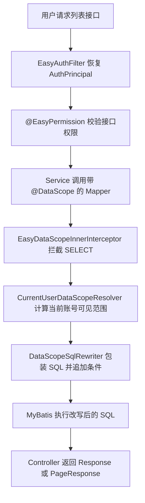

# 数据权限组件

## 适用场景

企业后台里，同一个列表接口通常不是所有人都能看全量数据。管理员可以看全部账号，部门负责人只能看本部门及以下，普通员工只能看本人相关数据。数据权限组件解决的是“能访问接口之后，还能看到哪些数据”的问题。

它适合用于用户、部门、流程任务、调度任务等带有组织归属或负责人字段的查询。它不替代接口权限：`@EasyPermission` 决定用户能不能调用接口，`@DataScope` 决定接口查询结果会被限制到什么范围。

不适合使用数据权限组件的场景：

- 登录、验证码、初始化、权限恢复这类还没有稳定登录上下文的查询。
- 必须跨组织读取的系统内部查询，例如审批参与人补齐、关系校验、任务派发内部查询。
- 无法在 SQL 外层结果中暴露部门字段或本人字段的复杂聚合查询。

## 如何使用

### 1. 数据库存储稳定编码

`sys_role.data_scope` 存储稳定 code，不存储中文。中文只作为前端 label、报表展示和文档解释。

| `sys_role.data_scope` | 中文展示 | 运行时类型 | 含义 |
| --- | --- | --- | --- |
| `ALL` | 全部数据 | `ALL` | 不追加数据范围条件 |
| `DEPT_AND_CHILDREN` | 本部门及以下 | `DEPT_AND_CHILDREN` | 当前部门及子部门 |
| `DEPT` | 本部门 | `DEPT` | 当前用户所在部门 |
| `SELF` | 本人数据 | `SELF` | 当前用户本人相关数据 |
| `DEPT_SETS` | 自定义部门 | `DEPT_SETS` | 启用角色绑定的部门集合 |

后端通过 `DataScopeType#fromRoleDataScope` 转换角色数据范围。保存和前端提交都必须使用 code，不接受中文展示值作为接口值。

多个角色会合并成一个可见范围。只要包含 `ALL`，最终就是全量范围；多个部门范围会取并集。

数据库初始化脚本对 `sys_role.data_scope` 加了 `NOT NULL` 和 `CHECK` 约束，角色授权保存时也会再次校验标准 code。发现中文、旧编码或空值时应通过迁移脚本先修正，不在运行时静默降级。

角色授权页会从后端读取当前账号可授予的数据范围。非超级管理员不能把角色授权成高于自身可见边界的范围：

| 当前账号数据范围 | 可授予角色的数据范围 |
| --- | --- |
| `ALL` | `ALL`、`DEPT_AND_CHILDREN`、`DEPT`、`SELF`、`DEPT_SETS` |
| `DEPT_AND_CHILDREN` | `DEPT_AND_CHILDREN`、`DEPT`、`SELF`、`DEPT_SETS` |
| `DEPT` | `DEPT`、`SELF`、`DEPT_SETS` |
| `DEPT_SETS` | `SELF`、`DEPT_SETS` |
| `SELF` | `SELF` |

选择 `DEPT_SETS` 时，部门 ID 还会校验是否真实存在、是否启用，以及是否落在当前账号可见组织范围内。

### 2. 在 Mapper 类上声明数据范围

类级注解适合 MyBatis-Plus 的 `selectList`、`selectPage`，这是标准列表页最常用的接入方式。

用户列表示例：

```java
@DataScope(
        methods = {DataScopeMapperMethods.SELECT_LIST, DataScopeMapperMethods.SELECT_PAGE},
        deptColumn = DataScopeColumns.DB_DEPT_ID,
        selfColumn = DataScopeColumns.USER_ID
)
public interface SysUserMapper extends BaseMapper<SysUser> {
}
```

部门列表示例：

```java
@DataScope(
        methods = {DataScopeMapperMethods.SELECT_LIST, DataScopeMapperMethods.SELECT_PAGE},
        selfColumn = DataScopeColumns.DEPT_ID
)
public interface SysDeptMapper extends BaseMapper<SysDept> {
}
```

流程任务示例：

```java
@DataScope(
        methods = {DataScopeMapperMethods.SELECT_LIST, DataScopeMapperMethods.SELECT_PAGE},
        deptColumn = DataScopeColumns.DB_ASSIGNEE_DEPT_ID,
        selfColumn = DataScopeColumns.DB_ASSIGNEE_ID
)
public interface WfTaskMapper extends BaseMapper<WfTask> {
}
```

`methods` 必须尽量收窄。不要在 Mapper 类上无差别覆盖所有方法，否则 `selectById`、`selectBatchIds` 这类内部查询也可能被误过滤。

### 3. 在 Mapper 方法上声明数据范围

方法级注解适合自定义查询。它比类级注解优先级更高，适合某个方法的过滤字段和默认字段不一致的场景。

```java
public interface CustomMapper {

    @DataScope(deptColumn = "org_id", selfColumn = "owner_id")
    List<CustomView> search(CustomQuery query);
}
```

方法级注解的核心价值是把“这个查询到底按哪个字段做部门过滤、按哪个字段做本人过滤”写在查询入口旁边，避免二开人员去 Service 里猜。

### 4. 字段名必须匹配外层查询

`deptColumn` 和 `selfColumn` 不是随便写实体属性名，它们必须是原 SQL 被包成子查询之后，外层查询能看到的列名或别名。

这就是为什么项目里会同时出现 `dept_id` 和 `deptId`：

- `dept_id`：原 SQL 外层直接暴露数据库列名，例如用户表的部门字段。
- `deptId`：MyBatis-Plus 或自定义查询把列投影成 Java 属性别名，例如 `id AS deptId`。

数据权限改写发生在 SQL 层，不知道 Java 实体字段语义。字段写错时，轻则查不到数据，重则 SQL 执行失败。

### 5. 系统内部查询显式绕过

如果业务逻辑需要查询完整数据用于校验或派单，必须显式写出绕过意图：

```java
SysUser manager = EasyDataScopeContext.ignore(() -> this.lambdaQuery()
        .eq(SysUser::getId, managerUserId)
        .one());
```

`ignore(...)` 使用 ThreadLocal 记录嵌套深度，执行结束后会恢复现场。不要把它包在 Controller 大范围入口上，只能包住确实需要全量数据的内部查询。

## 请求或执行流程



一次查询的关键步骤：

1. 登录后，会话快照里包含用户 ID、部门 ID、角色和数据范围。
2. Controller 先通过 `@EasyPermission` 判断能不能访问接口。
3. Service 调用 Mapper。
4. MyBatis-Plus 插件链触发 `EasyDataScopeInnerInterceptor#beforeQuery`。
5. 拦截器只处理 `SELECT`，并且只处理命中 `@DataScope` 的 Mapper 方法。
6. `CurrentUserDataScopeResolver` 从 `EasySecurityContext` 读取当前用户，计算 `DataScopeCondition`。
7. `DataScopeSqlRewriter` 把原 SQL 包成子查询，再追加外层条件。
8. 分页插件在数据权限插件之后执行，保证分页总数和列表数据使用同一套范围条件。

## 原理

数据权限组件分成两层：决策层和执行层。

决策层是 `CurrentUserDataScopeResolver`。它只回答一个问题：当前登录人对“带组织归属的数据”能看到什么范围。它不关心具体表名，也不拼 SQL。

执行层是 `EasyDataScopeInnerInterceptor` 和 `DataScopeSqlRewriter`。Mapper 用 `@DataScope` 告诉组件“这个查询结果里哪个字段代表部门，哪个字段代表本人”。拦截器在 SQL 执行前读取注解和权限范围，然后把原 SQL 改写成：

```sql
SELECT *
FROM (
    原始查询
) ea_ds
WHERE ea_ds.deptId IN (10, 20)
```

如果当前用户拥有全部数据权限，原 SQL 不改写。如果没有登录上下文、数据范围无法计算、本人范围但没有 `selfColumn`，组件默认追加 `1 = 0`，宁可查不到数据，也不误放开。

列名会经过白名单校验，只允许普通标识符，例如 `dept_id`、`deptId`、`assignee_id`。不允许 `dept_id;drop table` 这类拼接内容进入 SQL。

## 关键类、配置和表

| 类型 | 位置 | 作用 |
| --- | --- | --- |
| 注解 | `DataScope` | 标记 Mapper 查询需要自动追加数据范围 |
| 字段常量 | `DataScopeColumns` | 提供常用外层字段名，如 `deptId`、`userId` |
| 方法常量 | `DataScopeMapperMethods` | 提供 MyBatis-Plus 常用 Mapper 方法名 |
| 范围对象 | `DataScopeCondition` | 表达当前请求的可见范围 |
| 决策接口 | `DataScopeResolver` | 解耦“计算范围”和“改写 SQL” |
| 决策实现 | `CurrentUserDataScopeResolver` | 从当前用户、角色和部门树计算范围 |
| 元数据端口 | `DataScopeMetadataRepository` | 读取启用部门树和启用角色的自定义部门授权等权限元数据 |
| 元数据缓存 | `CachedDataScopeMetadataRepository` | 通过 `@Cacheable` 复用 Spring Cache，避免每次数据范围计算都查部门树和自定义部门表 |
| 缓存失效 | `@CacheEvict` | 部门、角色授权和用户角色变化后清理数据权限元数据缓存，提交后生效 |
| 拦截器 | `EasyDataScopeInnerInterceptor` | MyBatis 查询前识别注解并触发 SQL 改写 |
| SQL 构造 | `DataScopeSqlRewriter` | 包装原 SQL 并追加部门或本人条件 |
| 绕过上下文 | `EasyDataScopeContext` | 对系统内部查询显式跳过数据权限 |
| 插件配置 | `EasyMybatisConfig` | 将数据权限插件放在分页插件之前 |
| 枚举 | `DataScopeType` | 维护数据范围 code 和中文 label |
| 表 | `sys_role` | 保存角色数据范围 code |
| 表 | `sys_role_dept` | 保存自定义部门范围 |
| 表 | `sys_user_role` | 关联用户和角色 |
| 表 | `sys_dept` | 提供未删除且启用的部门树 |

后端分包按职责收敛在 `infrastructure/security/datascope` 下：

```text
annotation   # @DataScope 和 DataScopeColumns，给 Mapper 声明字段
context      # EasyDataScopeContext，显式绕过内部查询
model        # DataScopeType、DataScopeCondition，稳定 code 和运行时范围
resolver     # CurrentUserDataScopeResolver，计算当前账号可见范围
policy       # DataScopeAssignmentPolicy，角色授权可授予范围矩阵
repository   # DataScopeMetadataRepository，读取并缓存数据权限元数据
mybatis      # EasyDataScopeInnerInterceptor、DataScopeSqlRewriter，执行 SQL 改写
```

## Tradeoff

### 方案一：Mapper 注解 + MyBatis 拦截器

这是当前方案。

优点：

- 过滤靠近数据库执行，不会先查出越权数据再在内存过滤。
- 业务 Service 不需要在每个列表里重复拼部门条件。
- 分页前执行，分页总数和当前页数据一致。
- Mapper 必须显式声明字段，能看出哪些查询受数据权限保护。

缺点：

- 查询结果外层必须暴露过滤字段或别名。
- SQL 被包装成子查询后，复杂 SQL 的执行计划需要关注。
- 只适合标准行级过滤，复杂 ABAC 规则仍要在业务服务里补充。

适合 EasyNextAdmin 当前这种单体后台、MyBatis-Plus、MySQL、强 CRUD 的场景。

### 方案二：Service 层手写条件

每个 Service 根据当前用户自己拼 `dept_id in (...)` 或 `create_by = ?`。

优点：

- 逻辑显式，调试时容易从 Service 代码读懂。
- 对复杂业务规则更灵活。
- 不需要 SQL 改写插件。

缺点：

- 容易漏加条件，尤其是新增列表、导出、统计接口时。
- 同一套数据范围逻辑会散落在多个 Service。
- 分页、统计、导出可能各写一遍，长期容易不一致。

适合小项目或只有一两个受控查询的模块，不适合作为企业后台脚手架默认方案。

### 方案三：数据库行级安全或安全视图

把数据范围放进数据库层，例如 PostgreSQL RLS 或安全视图。

优点：

- 安全边界更靠近数据源。
- 多个应用共享数据库时，可以减少应用侧遗漏。

缺点：

- MySQL 没有 PostgreSQL 那种原生 RLS 能力，落地通常要靠视图、存储过程或会话变量，复杂度高。
- 应用用户、业务用户、部门树、角色版本之间的上下文传递难维护。
- 本项目的权限版本、会话快照和菜单权限都在应用层，强行下沉会让模型分裂。

适合数据库治理能力很强、跨应用共享同一套权限规则的企业，不适合作为 EasyNextAdmin 默认脚手架方案。

## 常见坑

- 只加 `@EasyPermission` 不加 `@DataScope`：接口能鉴权，但列表仍可能查到超范围数据。
- `@DataScope` 标了错误字段：SQL 外层看不到字段时会执行失败，或者查不到数据。
- 本人范围没有设置 `selfColumn`：组件会追加 `1 = 0`，避免误放开。
- 内部校验查询没有 `ignore(...)`：例如校验直属上级、部门负责人、流程参与人时，可能因为当前用户数据范围太小而查不到真实数据。
- 在 Controller 大范围使用 `ignore(...)`：这等于绕过整个请求的数据权限边界，应该禁止。
- 把数据权限当作接口权限：数据权限只决定“看哪些数据”，不能决定“能不能执行操作”。
- 把中文当作数据库枚举值：数据库、接口和审计日志都应使用稳定 code，中文只负责展示。
- 只在前端隐藏高风险选项：后端必须用授权矩阵再次校验，前端禁用只是操作体验，不是安全边界。

## 扩展建议

整理文档和代码时暴露出的后续优化点：

- 当前已缓存部门树和用户自定义部门集合；后续如果部门规模很大，可以继续缓存部门闭包或改用 `tree_path` 前缀查询，但必须保持组织变更后失效。
- SQL 包装成子查询对复杂报表可能影响执行计划，后续复杂查询可以保留手写 SQL + 方法级 `@DataScope`，并用集成测试验证。
- 组件文档稳定后，可以补一篇 `components/security/permission.md`，明确接口权限和数据权限的分工，避免二开时混用。
